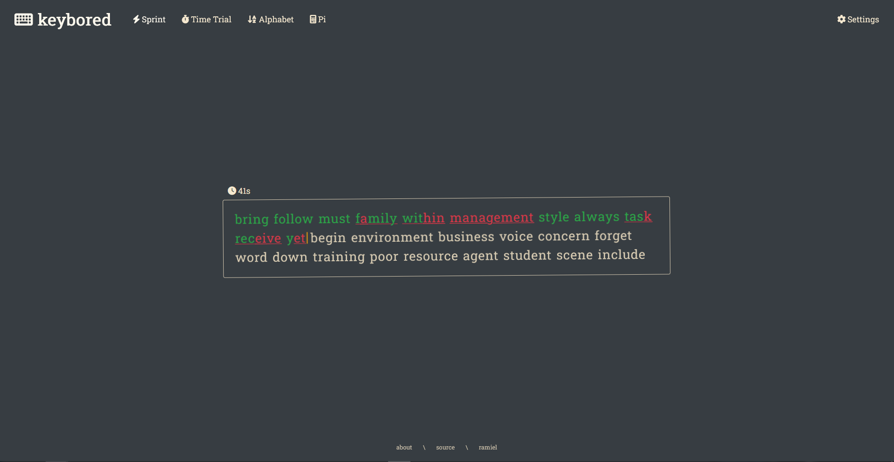
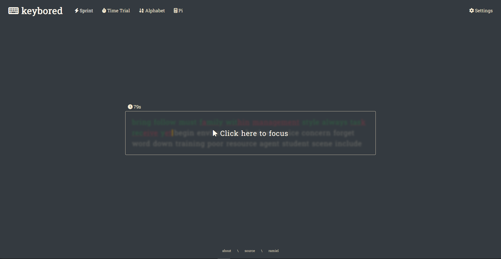
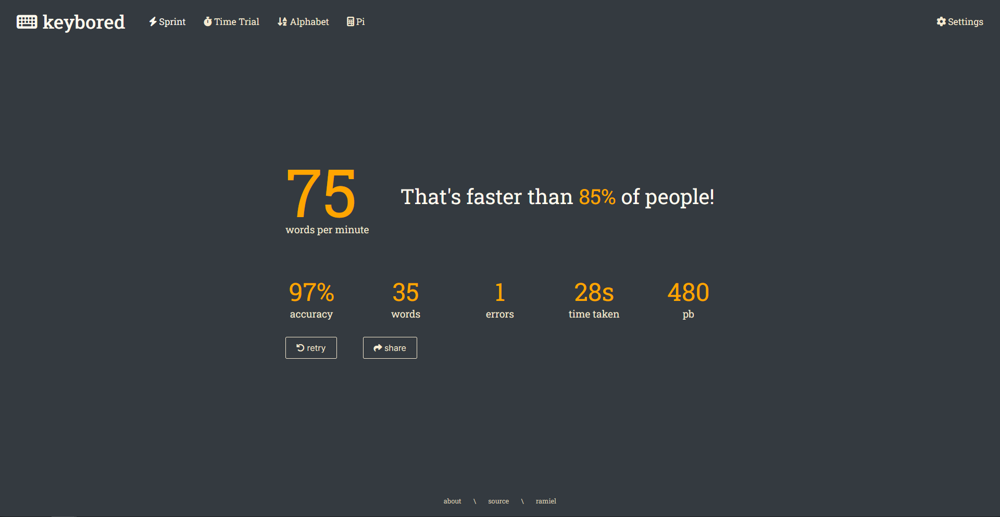
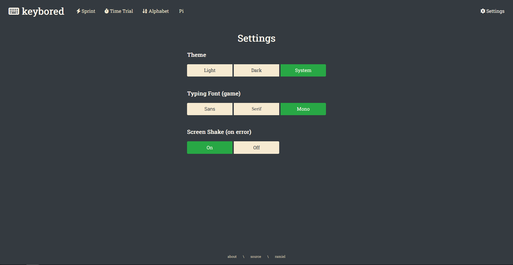
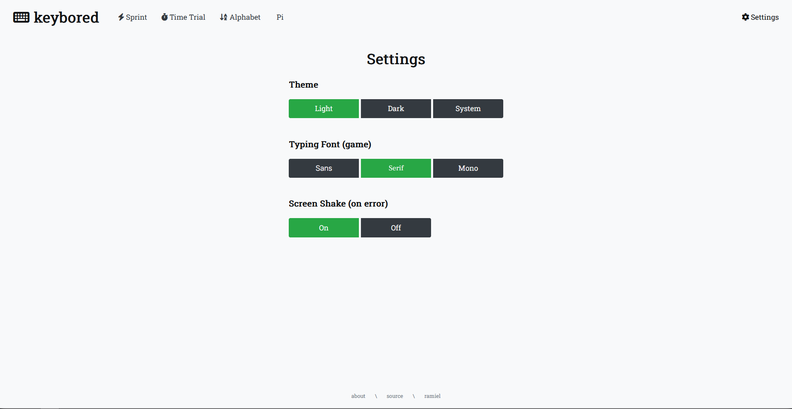
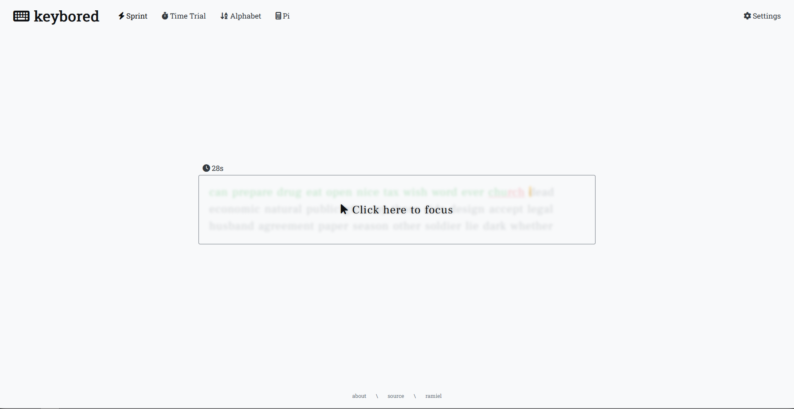

<h3 align="center"> keybored: online typing speed game</h3>

Test your words per minute in a series of games at <a href="https://keybored.ramiels.me/">keybored.ramiels.me</a>.

  
## Gamemodes

- Time trial:
  - Type as many words as you can in 30 seconds.
- Sprint:
  - Type a 35 word paragraph as fast as you can.
- Alphabet:
    - Type the alphabet as fast as you can.
- Pi:
    - Type as many digits of pi as you can, without making a mistake.
    - Under development.

  
## Settings

- Theme:
    - Toggle between light and dark mode.
- Font:
    - Choose between a Sans, Serif, or Monospace font for the game's text.
- Screen shake:
    - Toggle screen shake on error.

  
## Images

  
## Planned:

- [x] Screen shake on error
- [x] Fixed backspace bug
- [x] Time trial gamemode
- [x] Blur on not focused
- [x] Alphabet gamemode
- [x] Pi gamemode
- [ ] Small screen support
- [ ] Multiplayer
